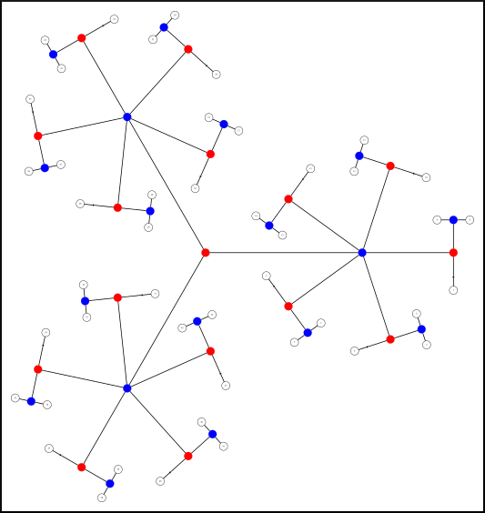

## Freely exchangeable data

For designs in which the data can be shuffled freely, there is no need to specify exchangeability blocks, and all observations are implicitly be assigned to the same large block. This also implies that the data is homoscedastic, i.e., same variance for all observations, and as a consequence, there is just one variance group (VG) for all data. The statistic that is computed by default is either t or F, depending on the rank of the contrast.

## Data exchangeable within block

If there are restrictions on exchangeability, blocks of data can be defined such that shuffling happens within block only. The exchangeability blocks file contains a single column vector with integer indices, each specifying a block. This file is supplied with the option -eb. An example is:

```
1
1
1
1
2
2
2
```

Permutations happen only between the observations that share the same index, i.e., within block only. For this kind of permutation, the blocks are not required to be of the same size. Moreover, it is no longer necessary to assume homoscedasticity, and by using the option `-vg auto`, each block is considered a variance group (VG). For the example above, this means that the automatic variance groups are:

```
1
1
1
1
2
2
2
```

Variances are estimated for each block, and statistics that are robust to heteroscedasticity are computed. In this case, instead of t, the Aspin-Welch v is calculated, and instead of F, the G statistic, which is a generalisation of all these common statistics.

However, if the user wants to group the observations differently based on other variance assumptions, irrespectively to the specification of exchangeability blocks, a file with variance groups indices can be supplied with the option `-vg`. The file format for the variance groups is always column vector with integer indices, similar as the example above.

## Blocks of data exchangeable as a whole

If there are restrictions on exchangeability, and if instead of shuffling within block, the blocks as a whole can be shuffled while keeping the observations inside the block in the same order, the exchangeability blocks file is supplied with the option `-eb`, exactly as above, and the flag `-whole` (whole-block shuffling) is supplied. An example of such file is:

```
1
1
1
2
2
2
```

Permutations and/or sign-flips, as applicable, will rearrange the blocks as a whole, not each observation individually. All blocks must be of the same size. Moreover, it is no longer necessary to assume homoscedasticity, and by using the option `-vg auto`, variance groups are defined such that the first group includes all the first observations in each block, the second group all the second observations in each block, and so on. For the example above, the automatic variance groups are:

```
1
2
3
1
2
3
```

Variances are then estimated within group, and statistics that are robust to heteroscedasticity are computed, i.e., instead of t, v is calculated, and instead of F, the G statistic is calculated. As in the within block case, the default definition of variance groups can be overridden with the specification of a variance groups file with the option `-vg`.

## Simultaneous whole- and within-block permutation

If the file supplied with the exchangeability blocks has just 1 column, the options `-within` and `-whole` can be used together to indicate that blocks can be shuffled as a whole, and that the observations can be further shuffled within-block.

## Complex dependence between data

It is possible to have multiple levels of complexity, each encompassing within-block and whole-block shuffling, which are then nested into each other. This can be done by supplying an exchangeability blocks file not with one, but with multiple columns. Each column indicates a deeper level of dependence. Indices on one level indicate how the unique sub-indices of the next level should be shuffled:

* Positive indices at a given level indicate that the sub-indices of the next level should be shuffled as a whole, akin to whole-block shuffling described above.
* Negative indices at given level indicate that the corresponding sub-indices in the next level should remain fixed and their own sub-sub-indices should be shuffled, akin to within block permutation described above.

With this more complex structure, the option -whole and -within, even if supplied, are ignored, as this information is embedded, at the multiple levels, in the file with the block definitions. In fact, even in the simpler cases of no blocks, within and whole block permutation, discussed above, can be fully specified using a multi-column exchangeability blocks file, regardless of these options.

*Example 1*: Freely exchangeable data. This is equivalent to having all observations in a single block, with no restrictions.

```
1 1
1 2
1 3
1 4
1 5
1 6
```

The 1st column indicates that all indices in the next level (1,...,6) can be shuffled with each other. This also implies a single large variance group that encompasses all observations.

*Example 2*: Three blocks of data that are exchangeable within block only.

```
-1 1
-1 1
-1 2
-1 2
-1 3
-1 3
```

The negative indices in the 1st column indicate that the sub-indices in the next column cannot be shuffled. The indices for each individual observation here were omitted, but could equivalently have been specified as:

```
-1 1 1
-1 1 2
-1 2 1
-1 2 2
-1 3 1
-1 3 2
```

The automatic VG looks like this

```
1
1
2
2
3
3
```

The positive indices in the 2nd column indicate that the respective sub-indices in the next column can be shuffled.

*Example 3*: Three blocks of data that are exchangeable as a whole.

```
1 1
1 1
1 2
1 2
1 3
1 3
```

The positive index in the 1st column indicates that the respective sub-indices in the next column (level) are exchangeable as a whole. The same could equivalently have been specified as:

```
1 -1 1
1 -1 2
1 -2 1
1 -2 2
1 -3 1
1 -3 2
```

The 1st column indicates that the sub-indices in the next level (2nd column) are exchangeable as a whole. The negative indices in the 2nd level indicate that each respective sub-index, now in the 3rd column is exchangeable with each other, i.e., within the blocks specified in the previous level.

The automatic VG looks like this

```
1
2
1
2
1
2
```

These same basic rules apply to hierarchies of blocks that can become far more complex.

## Visualisation of the block structure

A pictorial representation of the block structure can be produced using commands distributed with PALM and with the freely available [GraphViz](http://www.graphviz.org/) software package. The steps are:

1. Load the exchangeability blocks file:

   ```
   EB = csvread('EB.csv');
   ```
2. Load the design matrix, using either `palm_vestread` or `csvread`:

   ```
   M = palm_vestread('design.mat');
   ```

or

```
M = csvread('design.csv');
```

Alternatively, if you don't have a design matrix, but know that it would contain only continuous regressors, use simply:

```
M = (1:size(EB,1))';
```

1. Generate the permutation tree with:

```
EB = palm_reindex(EB,'fixleaves');
Ptree = palm_tree(EB,M);
```

1. Create a `.dot` file with:

```
palm_ptree2dot(Ptree,'ptree.dot');
```

1. Outside Matlab/Octave, run:

```
circo ptree.dot -Tsvg -o ptree.svg
```

The resulting `.svg` file can be opened in [Inkscape](https://inkscape.org/) or other vector-based imaging application, and edited for different colours and line styles and thicknesses as needed.

An example is shown below. At each permutation, branches beginning at blue dots can be permuted; those beginning in red dots cannot. Other examples and details are discussed in the respective [paper](http://www.sciencedirect.com/science/article/pii/S105381191500508X):



## EBs for data of the Human Connectome Project

To do permutation tests with HCP data, the EB file follows a multi-column format, defining blocks for each family that can be shuffled as a whole, and within these, subjects that can be permuted within family. To create this file considering the kinship of hundreds of HCP subjects would be laborious and error prone. Here we provide a Matlab/Octave script to automate this task. To use it, use the following steps:

1. Make sure you have been granted permission to use restricted HCP data. If not, apply for such permission following the instructions in the [HCP website](http://www.humanconnectome.org/) (see also the note below).
2. Once you have permission, download the most recent version of the file containing the restricted data. It's a CSV file that, once downloaded, is named something as `RESTRICTED_yourname_MM_DD_YY_HH_MM_SS.csv`.
3. Download the functions [`hcp2blocks.m`](https://raw.githubusercontent.com/andersonwinkler/HCP/master/share/hcp2blocks.m) and also its requisite [`strcsvread.m`](https://raw.githubusercontent.com/andersonwinkler/HCP/master/share/strcsvread.m), and put both into a directory where Matlab/Octave can find them (or add the location to the path with `addpath`).
4. Inside Matlab/Octave, run `hcp2blocks`. The simplest call is just:

   ```
   hcp2blocks('RESTRICTED_yourname_MM_DD_YY_HH_MM_SS.csv', 'EB.csv');
   ```

The above will create a file named `EB.csv` containing the block definitions for all subjects that have complete family information in the restricted file (that is, those with both father ID and mother ID, and with zygosity information), in the same order as in the restricted file, and ready to be used with the option `-eb` in PALM. The last column of the `EB.csv` file is the subject ID; it could have been any unique number, but the actual ID is used for convenience, and you can use this column to make sure that the order that the subjects are entered in the input files (supplied to PALM with `-i`) match the order as in this file. Alternatively, you can also swap the rows of `EB.csv` as needed to match the order of the inputs. However, you must not delete or include extra rows (see below how to select specific subjects). Also, don't delete any of the columns, not even the last one that has the subject IDs.

For permutation purposes, dizygotic twins (DZ) are treated differently than non-twins (NT), that is, DZ are by default not allowed to be shuffled with non-twin subjects, even in the same family. However, given that DZ pairs have the same kinship as NT siblings, you may consider allowing them so be swapped in permutations. You can give a 3rd argument to `hcp2blocks` as `true` to indicate that:

```
hcp2blocks('RESTRICTED_yourname_MM_DD_YY_HH_MM_SS.csv', 'EB.csv', true);
```

The above will treat DZ as NT, and allow these to be mixed freely as the shufflings are performed. If this 3rd argument is omitted, or marked as `false`, DZ will be treated as a category on their own.

To select only some specific subjects, you can provide a 4th argument, that is just a vector of subject IDs. For example:

```
hcp2blocks('RESTRICTED_yourname_MM_DD_YY_HH_MM_SS.csv', 'EB.csv', false, ...
   [100307 100408 101006 101107 101309 101410 101915 102008 102311 102816]');
```

The output will file will contain the EBs considering just these subjects, with each row in the same order as these subject IDs are indicated.

Once the EB.csv has been generated, it can be supplied to PALM with the option `-eb`.

If, for whatever reason, you'd like to have the definitions of the EBs in the Matlab/Octave workspace, it can be stored into a variable without the need to read the `EB.csv` from the disk:

```
EB = hcp2blocks(...);
```

All subjects are treated as part of the same large variance group, unless a custom file is supplied to PALM with `-vg`, or if `-vg auto` is used, in which case, the most restrictive possible variance group configuration will automatically be created, using the information from the exchangeability blocks file. Typically you won't want to do this with HCP data, so that the option `-vg` can be omitted.

Note: The restricted HCP file is used (as opposed to the unrestricted) because the field "age in years" is necessary to disambiguate a few (rare) cases, ruling out the possibility of twins if the ages are different. The full restricted file isn't actually needed, just the columns "Subject", "Mother\_ID", "Father\_ID", "ZygositySR", "ZygosityGT" and "Age\_in\_Yrs". The fields "ZygositySR" and "ZygosityGT" may be replaced by a single field "Zygosity".

## Generating the set of permutations only

If all that you need are the set of permutations and/or sign-flippings that respect restrictions on exchangeability, so that you can apply to your own algorithms, perhaps even in other programs, open Octave or Matlab and use the command `palm_quickperms`, that comes with PALM:

```
[Pset, VG] = palm_quickperms(M, EB, P, EE, ISE, CMCx, CMCp);
```

The inputs are:

| Name | Description |
| --- | --- |
| `M` | Design matrix. It can be the full, unpartitioned design, or if there are nuisance, simply the part that contains the EVs of interest. This distinction is only relevant if there are discrete EVs of interest and nuisance variables that are continuous. You may consider a partitioning as in the function `palm_partition`. If you have no idea what to use, it is in general safe to use as `M` simply a vector `(1:N)'`, where `N` is the number of rows in the design. This will not affect any regression and will only be used to define the permutations. You can also simply leave it empty (i.e., `[ ]`) if `EB` is supplied, and by default it will then be `(1:N)'`. If an `EB` isn't supplied, you can simply enter the value `N` in the place of `M` and by default it will be `(1:N)'`. |
| `EB` | Exchangeability blocks. It should be multi-level. For freely exchangeable data, leave empty (i.e., `[ ]`), or use `ones(N,1)`. If empty, a valid, non-empty `M` must be supplied, and the data will be shuffled freely. You can also simply enter `N` to the same effect. |
| `P` | Optional. The requested number of permutations. The actual number may be smaller if `N` is too small. Default is 5000. |
| `EE` | Optional. `true`/`false` indicating whether to assume exchangeable errors, which allow permutations. Default is `true`. |
| `ISE` | Optional. `true`/`false` indicating whether to assume independent and symmetric errors, which allow sign-flippings. Default is `false`. |
| `CMCx` | Optional. `true`/`false` indicating whether repeated rows in the design should be be ignored. Default is `false`. |
| `CMCp` | Optional. `true`/`false` indicating whether repeated permutations should be ignored. Default is `false`. For large `N` and large `P`, consider using `true` as it makes the generation of the permutation set much faster, with no practical difference at the end. |

All inputs are optional, but at least one of `M` or `EB` must be supplied.

The outputs are:

| Name | Description |
| --- | --- |
| `Pset` | Permutation set. It is a `N` by `P` matrix, thus having one permutation per column. Sign-flippings are represented with negative indices. To convert this to a cell array of permutation matrices, that can be used for matrix multiplication, see the command `palm_idx2perm`. |
| `VG` | Variance groups (VGs), to be used with a statistic that is robust to heteroscedasticity if needed. |

If you need to export `Pset`, use `dlmwrite` to save as a text file that can be imported elsewhere.

To generate the permutation set for HCP data, follow the instructions in the previous section (above) to generate the `EB` variable, then supply it to `palm_quickperms`.

Note that all this is only necessary if you need the set of permutations, which can be difficult to generate otherwise, e.g., in lexicographic order if exhaustive, or permutations with sign-flippings (sometimes called "wild bootstrap"), or shufflings that respect complex exchangeability, so that these permutations can be used with your own algorithms. It is not necessary to use `palm_quickperms` in any situation in which you can use PALM directly, since it is all done internally.

If you use the set of permutations in your algorithms, please cite the two papers below.

## References

The methods used in PALM to handle exchangeability blocks are described in:

> Winkler AM, Webster MA, Vidaurre D, Nichols TE, Smith SM. [Multi-level block permutation.](http://www.sciencedirect.com/science/article/pii/S105381191500508X) Neuroimage. 2015;123:253-68. (Open Access)

> Winkler AM, Ridgway GR, Webster MA, Smith SM, Nichols TE. [Permutation inference for the general linear model.](http://www.sciencedirect.com/science/article/pii/S1053811914000913) NeuroImage, 2014;92:381-397. (Open Access)