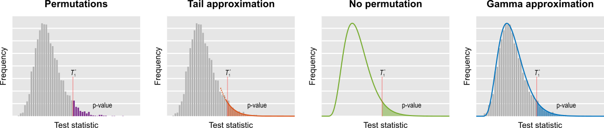
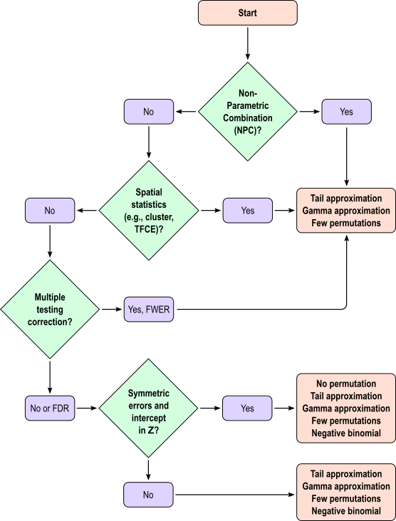

Permutation tests are computationally intensive. For small, non-imaging datasets, recomputing a model thousands of times is seldom a problem, but for large, complex models this can be prohibitively slow, even with the availability of inexpensive computing power. PALM offers the possibility of accelerating the inference through properties of statistics used with the general linear model (GLM) and their distributions, in a way that is irrespective of software or hardware improvements.

| Method | Brief description | Availability | Basic usage |
| --- | --- | --- | --- |
| **Few permutations** | Compute the p-values using just a few permutations, e.g., less than a thousand. | Univariate and multivariate tests (CMV and NPC), both uncorrected and corrected (FWER and FDR). Spatial statistics available (TFCE and cluster). | `-n <nperms>` |
| **Negative binomial** | Run for each voxel as many permutations as needed until a predefined number of exceedances is found. Then divide this number of by the number of permutations. | Univariate tests, uncorrected and corrected (FDR). No spatial statistics with this method. | `-accel negbin` |
| **Tail approximation** | Run a small number of permutations and, for the p-values below a certain threshold (e.g., 0.10), fit a generalised Pareto distribution, modelling the tail of the permutation distribution. | Univariate and multivariate tests (CMV and NPC), both uncorrected and corrected (FWER and FDR). Spatial statistics available (TFCE and cluster). | `-accel tail` |
| **No permutation** | For statistics that can be written as `trace(AW)`, where `A = X*pinv(X)`, `W = UU'`, `USV = svd(RY)`, `R = I-Z*pinv(Z)`, compute analytically the moments of the permutation distribution, then fit a gamma distribution. | Univariate and multivariate tests (CMV only), uncorrected and corrected (FDR). No spatial statistics with this method. | `-accel noperm` |
| **Gamma approximation** | Run a small number of permutations, compute empirically the moments of the permutation distribution, then fit a gamma distribution. | Univariate and multivariate tests (CMV and NPC), both uncorrected and corrected (FWER and FDR). Spatial statistics available (TFCE and cluster). | `-accel gamma` |
| **Low rank matrix completion** | Run a certain number of permutations, define orthonormal bases for matrices that are linear functions of the data and from which the statistic can be obtained; continue permuting a random subset of tests, filling the missing ones via projection to these bases. | Univariate tests, uncorrected and corrected (FWER and FDR). No spatial statistics for this method (theoretically possible, but not implemented). | `-accel lowrank` |

In the table, **CMV** stands for Classical Multivariate Tests (such as MANOVA, MANCOVA, CCA), whereas **NPC** stands for Non-Parametric Combination. See [[Joint inference]] for details.

The figure below summarises the methods: With permutations (i.e., few permutations, negative binomial, and low rank matrix completion), the p-value is the fraction of the test statistics obtained after permuting that are higher than in the unpermuted. In the tail approximation, the tail of the permutation distribution is subjected to the fit of a generalised Pareto distribution (GPD), from which the p-values are computed. In the method in which no permutations are performed, the first three moments of the permutation distribution are computed from data and model, and to these which a gamma distribution is fitted, and from which the p-values are computed. In the gamma approximation, the moments of the empirical permutation distribution are used to the fit of the gamma distribution. The figure is merely illustrative: the actual fit uses the cumulative distribution function directly, such that histograms are not constructed.



## Methods available

### Few permutations

This method consists of simply choosing a small number of permutations, e.g., less than 1000. To run, use:

```
palm [...] -n 500
```

### Negative binomial

This method consists of running as many permutations as needed until a fixed, pre-defined number of exceedances is found. An exceedance is an event in which the statistic after permutation is larger or equal than in the unpermuted case. The procedure continues until all possible permutations have been exhausted, or until a very large limit is reached. To run, use:

```
palm [...] -accel negbin [nexced]
```

If the number of exceedances is omitted, the default is 2. The number of permutations to keep trying can be indicated with the option `-n`, but in this case, it would be a large number. For example:

```
palm [...] -accel negbin 4 -n 100000
```

### Tail approximation

This method consists of running a number of permutations, then fitting a Generalised Pareto Distribution (GPD) to the tail of the distribution. The p-values are computed from the GPD. To run, use:

```
palm [...] -accel tail [pthr]
```

The parameter `pthr` indicates the permutation p-value below which the GPD fit will be used. For the permutation p-values above this number, there will be no changes. The default `pthr` (if omitted) is 0.10.

The number of permutations used to build the initial null distribution is controlled by the option `-n`:

```
palm [...] -accel tail -n 500
```

For large datasets, or for a large number of permutations, this method can be memory intensive for uncorrected and for FDR corrected p-values. In these cases, consider using the option `-nouncorrected`:

```
palm [...] -accel tail -n 500 -nouncorrected
```

### No permutation

This method consists of first computing analytically the first three moments of the permutation distribution of test statistics that can be written in the form `trace(AW)`, where `A = X*pinv(X)`, `W = UU'`, `USV = svd(RY)`, `R = I-Z*pinv(Z)`, and `I` is the identity matrix of size `N`, where `N` is the number of subjects. Once the moments have been estimated, gamma distribution (also known as Pearson type III distribution) with same moments is used to calculate the p-values. Differently than all other methods, permutations are not actually performed, yet the p-values are based on permutations. To run, use:

```
palm [...] -accel noperm
```

This method cannot be used in cases in which only sign-flippings would be used (`-ise`), nor with exchangeability blocks or variance groups, and cannot be used to test the intercept (i.e., the intercept must be entirely contained in the set of nuisance variables, but not among the variables of interest). The test can be used when the distribution of the errors is symmetric as a replacement to permutations.

### Gamma approximation

This method consists of running a number of permutations, then fitting a gamma distribution to the whole null distribution. The p-values are computed from the gamma distribution. To run, use:

```
palm [...] -accel gamma
```

The number of permutations used to build the initial null distribution is controlled by the option `-n`:

```
palm [...] -accel gamma -n 500
```

As with the tail approximation, for large datasets, or for a large number of permutations, this method can also be memory intensive for uncorrected and for FDR corrected p-values. In these cases, consider using the option `-nouncorrected`:

```
palm [...] -accel gamma -n 500 -nouncorrected
```

### Low rank matrix completion

This method consists of running a small number of permutations (call this number \(J0\)), then for the subsequent permutations, use only a subset containing a small number \(V0\) of voxels. This subset is chosen randomly. The remaining voxels that are not tested have their exact test statistic computed from the others using low rank matrix completion theory. For this method, both \(J0\) and \(V0\) must be larger or equal than \(N(N+1)/2\). To run, use:

```
palm [...] -accel lowrank [val]
```

where `val` is either:

* A positive value less than 1, indicating the fraction of the total tests (usually voxels) that will be randomly sampled.
* An integer greater than 1, indicating the number \(V0\) of tests that will be randomly sampled.

The default `val` is NaN, indicating that PALM will compute it from the sample size as \(V0 = N\*(N+1)/2\). The overall number of permutations (fully sampled plus the ones with values filled in) can be specified with the option `-n` as usual.

Gains in speed with low rank matrix completion are noticeable only for large images and small number of subjects. Otherwise, the other methods above tend to be faster.

## Recommendations

From all the methods, the one that is the most general, applicable to a wider variety of situations, including corrected and uncorrected p-values, spatial and multivariate statistics (classical and NPC), and which also showed overall a good performance and a good tradeoff with resampling risk is the **tail approximation**, and this method is recommended generally. Other methods can also be considered in a variety of scenarios.

The flow chart below gives overall guidance on which method to use in particular applications.



## Advanced usage

The tail and gamma approximation can take one extra argument called `out`:

```
palm [...] -accel tail [pthr] [out]
palm [...] -accel gamma [out]
```

This is a `true`/`false` indicating whether the unpermuted statistic should be left out of the null distribution. The default is `false`, indicating that the unpermuted statistic is included in the null. This setting rarely (if ever) needs to be changed.

## References

The reference for the accelerated permutation tests is:

> Winkler AM, Ridgway GR, Douaud G, Nichols TE, Smith SM. [Faster permutation inference in brain imaging.](http://www.sciencedirect.com/science/article/pii/S1053811916301902) Neuroimage. 2016 Jun 7;141:502-516. (Open Access)

The main general reference for PALM is the same as for randomise:

> Winkler AM, Ridgway GR, Webster MA, Smith SM, Nichols TE. [Permutation inference for the general linear model.](http://www.sciencedirect.com/science/article/pii/S1053811914000913) NeuroImage, 2014;92:381-397 (Open Access)

For NPC, CMV assessed with permutations, and for correction over contrasts and/or modalities (options `-corrcon` and `-corrmod`), the reference is:

> Winkler AM, Webster MA, Brooks JC, Tracey I, Smith SM, Nichols TE. [Non-Parametric Combination and related permutation tests for neuroimaging.](http://onlinelibrary.wiley.com/doi/10.1002/hbm.23115/epdf) Hum Brain Mapp. 2016 Apr;37(4):1486-511. (Open Access)