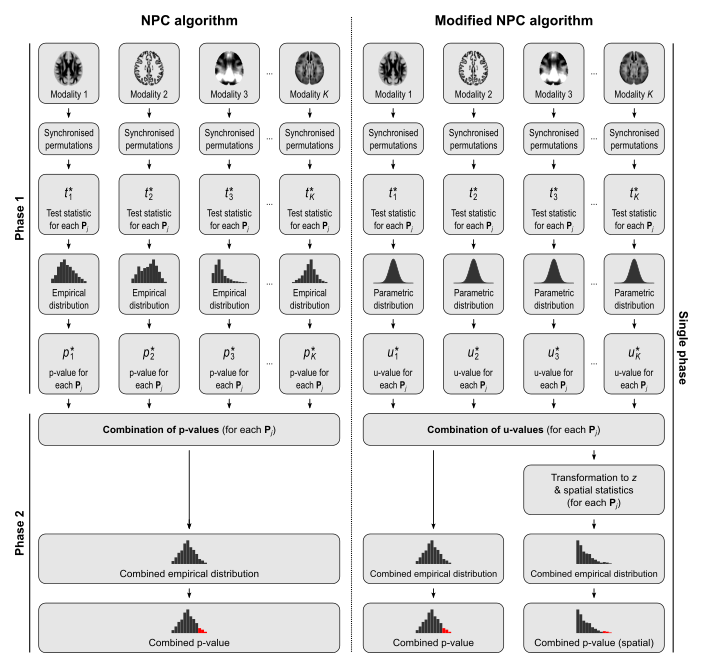
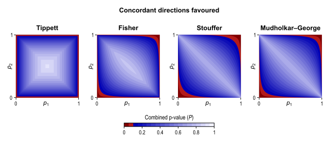
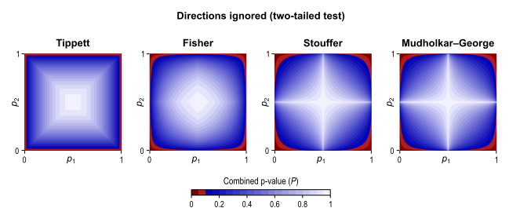

## Non-Parametric Combination (NPC)

### Overview

The Non-Parametric Combination (NPC) is a way to perform joint inference on multiple data collected on the same experimental units (e.g., same subjects), with minimal assumptions. The NPC consists of, in a first phase, testing each hypothesis separately using permutations that are performed synchronously across datasets; these tests are termed partial tests. The resulting statistics for each and every permutation are recorded, allowing an estimate of the complete empirical null distribution to be constructed for each one. In a second phase, the empirical p-values for each statistic are combined, for each permutation, into a joint statistic. As such a combined joint statistic is produced from the previous permutations, an estimate of its empirical distribution function is immediately known, and so is the p-value of the joint test.

As originally proposed, NPC cannot feasibly be used in brain imaging. As the statistics for all partial tests for all permutations need to be recorded, an enormous amount of space for data storage is necessary. Even if storage space were not a problem, the discreteness of the p-values for the partial tests is problematic when correcting for multiple testing, because with thousands of tests in an image, ties are likely to occur, further causing ties among the combined statistics, causing the test to be not powerful (although still valid). The most obvious workaround -- run an ever larger number of permutations to break the ties -- may not be possible for small sample sizes, or when possible, requires correspondingly larger data storage.

The solution is to use a modified version of the NPC, starting from the principles that underlie direct combination of statistics, by computing for each partial test quantities that behave similarly as p-values; we call these as "u-values", to emphasise that they are not meant to be read or interpreted as p-values, but rather as transitional values that allow combinations that otherwise would not be possible. The algorithm proceeds then in single phase, with permutations being performed on-the-fly, and with no need for storage of the complete permutation distribution at each voxel. Another modification needed for brain imaging refers to spatial statistics: the asymptotic distribution of the combined statistic is used, this time to produce a z-score, from which cluster extent, cluster mass, and TFCE can be computed. A flow chart showing both the original and the modified algorithm is shown below.

### Combining functions

The joint null hypothesis of the NPC is that the null hypotheses for all partial tests are true, and the alternative is that any is false (that is, the same as a union-intersection test, UIT). This marks a sharp distinction versus a conjunction test, for which the joint null hypothesis is that the null hypotheses for any of the partial tests are true, and the alternative is that all are false (that is, the same as an intersection-union test, IUT).

The rejection region for the joint null hypothesis depends on how the combined statistic is produced. Various combining functions can be considered. Some of these were developed for applications such as meta-analyses. The figure below shows the rejection regions for four different popular combining functions, i.e., the ones attributed to Tippett, Fisher, Stouffer, and Mudholkar-George, and considering two partial tests, for which p-values (p1 and p2) are available.

In the NPC, these combining functions can be used even if the partial tests are not independent, as their dependence structure, whatever it might be, is implicitly accounted for during by synchronised permutation procedure.

The simple combination as above implies a specific direction for each of the partial tests (e.g., positive or negative). If the hypotheses for the partial tests have mismatching directions, the imaging data for some of them can be multiplied by (-1), and the combination proceeds otherwise as usual.

Another situation arises if there is no a priori direction suspected for an effect, but concordant directions for the partial tests (either direction) are more relevant than mismatching. The rejection regions for these four examples of combining functions would then be as in the figure below:

It might also be the case that both directions are equally interesting for each of the partial test. If that is the case, a two-tailed test for each partial test is ideal, and the rejection region for these four examples would be as below:

One of the many reasons for the superiority of NPC when compared to classical multivariate tests, such as MANCOVA, refers to its finite sample consistency, that is, even with fixed sample size, as the number of modalities being combined increases, the power of the test also increases, as shown in the simulations in the reference below. The power of MANCOVA, however, increases up to a certain point, then begins to decrease, eventually reaching zero when the number of combining variables match the sample size.

### How to run

NPC can be performed across multiple modalities using a common design and set of contrasts, or for a single modality across multiple designs and contrasts, or across multiple modalities and multiple designs and contrasts.

Running it in PALM is simple:

1. Specify the modalities with the option `-i`, as many times as needed.
2. Specify designs and contrasts with the options `-d`, `-t`, and `-f`, as many times as needed. The contrasts can alternatively be specified with the option `-con` (`.mset` files), using just the `<file1>` (i.e., only the C contrasts, not the D contrasts; see below the section on MANCOVA).
3. [Optional] If the designs pair up with inputs, use `-designperinput`.
4. Use the option `-npcmod` to indicate that NPC should be performed across modalities, the option `-npccon` to indicate that NPC should be performed across all contrasts, or both `-npcmod` and `-npccon` to indicate that NPC should be done across all input modalities and all contrasts.
5. [Optional] Use the option `-npcmethod <method> [parameters]` to indicate which combining function should be used. The functions currently available are: `Tippett`, `Fisher`, `Pearson-David`, `Stouffer`, `Wilkinson`, `Winer`, `Edgington`, `Mudholkar-George`, `Friston`, `Darlington-Hayes`, `Zaykin`, `Dudbridge-Koeleman` (2 variants), `Taylor-Tibshirani` and `Jiang`. The methods of `Darlington-Hayes` and `Dudbridge-Koeleman` require that their parameter `r` is indicated. The methods of `Wilkinson`, `Zaykin` and `Jiang` require that their parameter `alpha` is indicated. The method `Dudbridge-Koeleman2` requires both `r` and `alpha` (in this order). The other methods require no parameters. Consult the reference below for an overview of these combining functions and detailed references. If the option `-npcmethod` is omitted, the default is `Fisher`.
6. [Optional] If partial tests with concordant directions should be favoured, use the option `-concordant`.
7. [Optional] If the direction of the partial tests do not matter, use the option `-twotail`.
8. Specify all other options that you might need, such as whether to compute spatial statistics, output string, number of permutations, multi-level exchangeability blocks, permutations and/or sign-flippings, etc.

Note that the options `-concordant` and `-twotail` cannot be used simultaneously, otherwise the combined test becomes *inadmissible*, and an error will be printed. See the reference below for details.

The option `-npc` (no parameters) is a shortcut to the options `-npcmethod <default method> -npcmod`. The default method is `Fisher`.

The options `-corrmod` and `-corrcon`, to correct across modalities and contrasts, can be used with NPC.

## Classical multivariate tests (e.g., MANOVA, MANCOVA)

Although NPC is more powerful and entails fewer assumptions than classical multivariate tests, it might still be the case that these tests, that predate modern computers by decades, can be useful in some scenarios. The null hypothesis of MANCOVA is `H0: C'*Beta*D`, where `C` is a contrast of regression coefficients on independent variables, `D` is contrast of regression coefficients on response variables, and `Beta` are the (multivariate) regression coefficients of the general linear model. Often `D` is omitted, and implicitly assumed as an identity matrix of the same size as the number of dependent variables.

To run a MANOVA/MANCOVA design, computing the p-values through permutations:

1. Specify the multiple input modalities with the option `-i` multiple times.
2. Specify the designs with the option `-d`, and contrasts with `-t` and `-f`. Alternatively, enter the pairs of contrasts `C` and `D` with the option `-con <file1> <file2>`, where `<file1>` is a file with multiple contrasts `C` and `<file2>` with multiple contrasts `D`. Each contrast in `C` pairs with a contrast in `D`, and these must be in the `.mset` format.
3. Enable classical multivariate tests by including the option `-mv <statistic>`, where the statistic can be `Wilks` (for Wilks' lambda), `Hotellingtsq` (for Hotelling's \(T^2\)), `Lawley` (for Lawley-Hotelling's trace), `Pillai` (for Pillai's trace), `Roy_ii` or `Roy_iii` (for either of the two Roy's largest roots, as defined in items ii and iii of the Roy (1953) paper). If the statistic is omitted, the default is Wilks' lambda.
4. Specify all other options that you might need, such as whether to compute spatial statistics, output string, number of permutations, multi-level exchangeability blocks, permutations and/or sign-flippings, etc.

The option `-designperinput` cannot be used together with `-mv`, as all inputs are used with each design. The option `-corrcon`, to correct across contrasts, can be used.

## References

The methods used in PALM to handle joint inference (NPC and classical multivariate) are described in:

> Winkler AM, Webster MA, Brooks JC, Tracey I, Smith SM, Nichols TE. [Non-Parametric Combination and related permutation tests for neuroimaging.](http://onlinelibrary.wiley.com/doi/10.1002/hbm.23115/epdf) Hum Brain Mapp. 2016 Apr;37(4):1486-511. (Open Access)

The general reference for the permutation tests used in PALM is the same as for randomise:

> Winkler AM, Ridgway GR, Webster MA, Smith SM, Nichols TE. [Permutation inference for the general linear model.](http://www.sciencedirect.com/science/article/pii/S1053811914000913) NeuroImage, 2014;92:381-397 (Open Access)