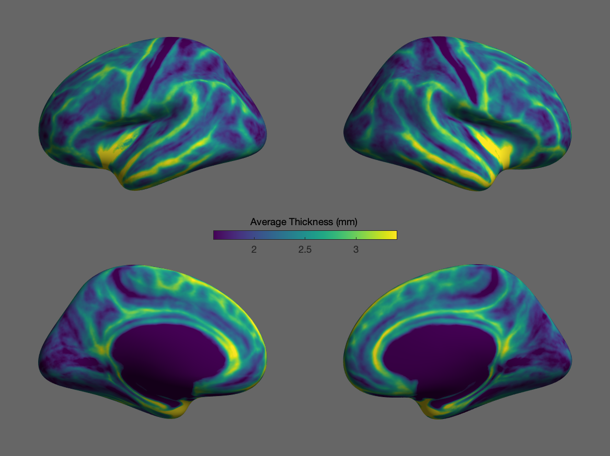
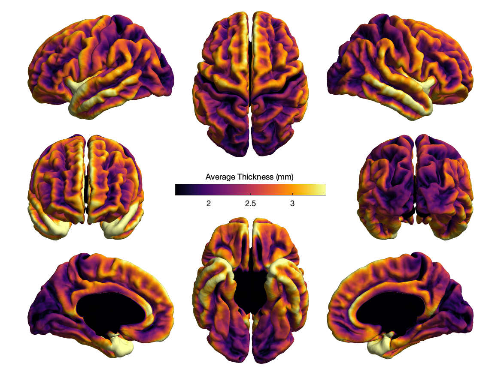
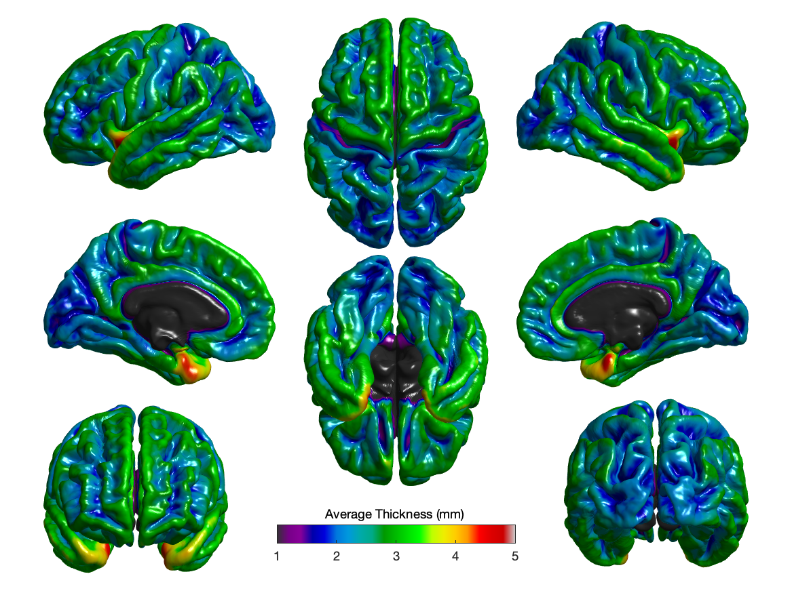

# View results

To view the results of an analysis done with PALM, use [FSLeyes](https://fsl.fmrib.ox.ac.uk/fsl/docs/utilities/fsleyes.html). FSLeyes can handle most of the imaging outputs, including volume and surface formats.

For CSV files, multiple outputs can be concatenated with the shell utility `cat`, then opened in a spreadsheet software such as [LibreOffice](https://www.libreoffice.org/) or Microsoft Excel.

Of course, other software can be considered, e.g., [FreeView](http://surfer.nmr.mgh.harvard.edu/fswiki/FreeviewGuide), [Connectome Workbench](https://humanconnectome.org/software/connectome-workbench), [Mango](http://rii.uthscsa.edu/mango/), [MRIcron](https://people.cas.sc.edu/rorden/mricron/index.html), or [SurfIce](https://www.nitrc.org/projects/surfice/) (the latter offers great surface visualisation capabilities, and also, it is particularly good for the highly efficient [MZ3](https://github.com/neurolabusc/surf-ice/tree/master/mz3) surface file format, as well as for the less efficient but friendly ASCII-type DPV).

## A simple viewer

A very simple visualisation utility for surface-based data is provided with PALM: the function `palm_viewsurf.m`. It works with both Octave and MATLAB. Usage is as follows:

```
h = palm_viewsurf( { lh_dat_file, rh_dat_file }, { lh_srf_file, rh_srf_file }, Name1, Value1, Name2, Value2, ...)
```

The first argument is a cell-array with two elements: the first is the filename of the data to visualise for the left hemisphere, the second is the filename of the data for the right hemisphere.

The second argument is also a cell-array with two elements: the first is the surface file for the left hemisphere, the second is the surface file for the right hemisphere.

File formats for these two arguments are those accepted by PALM.

All subsequent arguments are supplied as pairs `Name, Value`, as typical in many MATLAB/Octave commands. Accepted Names and descriptions are:

| Name | Description |
| --- | --- |
| `mapname` | MATLAB/Octave colourmap. Default is `'viridis'`. Any colour maps available in MATLAB/Octave can be used. Additional colour maps are available in the subdirectory `colourmaps` of PALM. You can add your own colour maps here too. |
| `datarange` | Interval to be used to define the colourscale [min max]. If not specified, it uses the min and max of the DPX file. |
| `showrange` | Interval to be shown (coloured) `[min max]`. If not specified, it uses the same as `datarange`. |
| `dual` | `true`/`false`. If `true`, applies the map to the values of no overlap between datarange and showrange. Useful for thresholded positive+negative maps. Default is `false`. |
| `colourgap` | Colour for values that off the colourscale, including NaN. Default is light gray, 25%, i.e. `[.75 .75 .75]`. |
| `coption` | `true`/`false`. The behavior varies if `dual` is `true` or not. Default is `true`. For `dual = true`: If `coption` is `false`, don't rescale the extremities of the colourmap; with the default being `true`, it produce a higher contrast. For `dual = false`: If `coption` is `false`, show the out-of-range values with the colour specified by `colourgap` ; with the default being `true`, the out-of-range values are shown with the extremities of the colour map. |
| `mapsize` | Maximum number of colours in the colourmap. Default \(2^14\) (32768). Note that currently Octave cannot handle more than this. |
| `title` | Title of the figure (to appear at the top of the colourbar). Default is nothing `()`. |
| `layout` | How to distribute the brain views in the page? The following layouts are available: `simple` (a simple layout meant to be interactively explored using the MATLAB/Octave figure tools), `cardinal` (shows 4 views, i.e., lateral and medial of left and right hemispheres, plus colour bar in the centre), `left` (left hemisphere only, lateral and medial views), `right` (right hemisphere only, lateral and medial views), `strip` (similar to cardinal but shows all views in a single row; useful for stacking subjects), `publication` (a well rounded layout, meant to be nearly ready for publication. It always includes a colourbar), and `worsley` (the layout proposed by K. Worsley; it always includes a colourbar). Default is `publication`. |
| `background` | A 3-element vector of the RGB color of the background. Default is `[1 1 1]` (white). |
| `camlight` | Boolean indicating whether a light should be placed in the same location as the camera. Default is `true`. |
| `lightning` | Lighting mode. Valid options are: `none`, `flat`, `gouraud`. Default is `gouraud`. |
| `material` | Material mode. Valid options are: `dull`, `shiny`, `metal`. Default is `dull`. |
| `shading` | Shading mode. Valid options are: `flat`, `interp`, `faceted`. Default (and recommended) is `interp`. |
| `colourbar` | Boolean indicating whether the colour bar should be shown. Note that for the `publication` and `worsley` layouts, the colour bar is always shown. |

The options `dual` and `coption`, as well as how they interact with `datarange` and `showrange`, are detailed in this page.

The output `h` is the handle for the figure window that contains the graphics. Use this handle to configure figure properties, including paper size, paper orientation, margins, etc. To generate outputs of high quality, ready for publication, use the MATLAB or Octave command `print`, in which the output format (e.g., PDF or PNG) can be defined, as well as the resolution and other properties.

## Examples

```
freesurfer_home = getenv('FREESURFER_HOME');
data = { ...
fullfile(freesurfer_home,'subjects','fsaverage','surf','lh.thickness'), ...
fullfile(freesurfer_home,'subjects','fsaverage','surf','rh.thickness') };
surfs = { ...
fullfile(freesurfer_home,'subjects','fsaverage','surf','lh.inflated'), ...
fullfile(freesurfer_home,'subjects','fsaverage','surf','rh.inflated') };
palm_viewsurf(data,surfs,'layout','cardinal','datarange',[1.6 3.4],'mapname','viridis','title','Average Thickness (mm)','background',[0.4 0.4 0.4]);
```



```
freesurfer_home = getenv('FREESURFER_HOME');
data = { ...
fullfile(freesurfer_home,'subjects','fsaverage','surf','lh.thickness'), ...
fullfile(freesurfer_home,'subjects','fsaverage','surf','rh.thickness') };
surfs = { ...
fullfile(freesurfer_home,'subjects','fsaverage','surf','lh.pial'), ...
fullfile(freesurfer_home,'subjects','fsaverage','surf','rh.pial') };
palm_viewsurf(data,surfs,'layout','publication','datarange',[1.6 3.4],'mapname','inferno','title','Average Thickness (mm)');
```



```
palm_viewsurf(data,surfs,'layout','worsley','datarange',[1 5],'mapname','spectral','title','Average Thickness (mm)','lightning','gouraud','material','shiny');
```



## References

The main reference to PALM is:

> Winkler AM, Ridgway GR, Webster MA, Smith SM, Nichols TE. [Permutation inference for the general linear model.](http://www.sciencedirect.com/science/article/pii/S1053811914000913) NeuroImage, 2014;92:381-397. (Open Access)

For a brief description and examples of shading methods in the context of brain imaging, see:

> Winkler AM, Sabuncu MR, Yeo BT, Fischl B, Greve DN, Kochunov P, Nichols TE, Blangero J, Glahn DC. [Measuring and comparing brain cortical surface area and other areal quantities.](https://www.sciencedirect.com/science/article/pii/S1053811912002996) Neuroimage. 2012 Jul 16;61(4):1428-43.